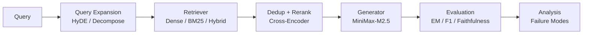
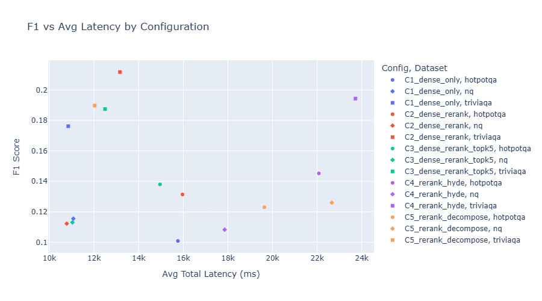
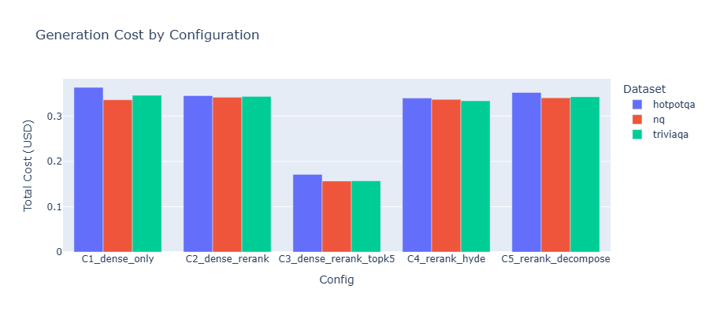

# RAG Benchmark Study

Modular RAG benchmark system with systematic component-level evaluation on standard QA benchmarks. Evaluates retrieval strategies across **accuracy, latency, and cost** on HotpotQA, Natural Questions, and TriviaQA.

## Architecture



### Key Components

| Component | Implementation | Details |
|-----------|---------------|---------|
| Dense Retrieval | FAISS (flat / sharded) | 21M Wikipedia passages, all-MiniLM-L6-v2 |
| Sparse Retrieval | rank-bm25 | BM25 index for hybrid search |
| Reranker | cross-encoder/ms-marco-MiniLM-L-6-v2 | Cross-encoder with rank fusion blending |
| Query Expansion | HyDE, HotpotQA Decompose | LLM-based query rewriting |
| Generation | OpenAI-compatible API | MiniMax-M2.5 with reasoning split |
| Evaluation | EM, F1, Recall@k, Faithfulness | LLM-as-judge for faithfulness scoring |
| Analysis | Failure mode classification | HotpotQA taxonomy + generic failure modes |

## Experiment Matrix

5 configurations evaluated across 3 datasets with 200 queries each:

| Config | Retriever | Reranker | Query Expansion |
|--------|-----------|----------|-----------------|
| C1 Dense Only | dense_sharded | off | off |
| C2 Dense+Rerank | dense_sharded | on | off |
| C3 Dense+Rerank (top-5) | dense_sharded | on | off (narrow context) |
| C4 Rerank+HyDE | dense_sharded | on | HyDE (all datasets) |
| C5 Rerank+Decompose | dense_sharded | on | auto (HyDE for NQ, off for others) |

## Results

| Config | HotpotQA F1 | NQ F1 | TriviaQA F1 | Avg F1 | Cost/200q |
|--------|------------|-------|------------|--------|-----------|
| C1 Dense Only | 0.101 | 0.116 | 0.176 | 0.131 | $0.35 |
| C2 Dense+Rerank | 0.131 | 0.112 | **0.212** | 0.152 | $0.34 |
| C3 Dense+Rerank (top-5) | 0.138 | 0.113 | 0.187 | 0.146 | **$0.16** |
| C4 Rerank+HyDE | **0.145** | 0.108 | 0.194 | 0.149 | $0.34 |
| C5 Rerank+Decompose | 0.123 | **0.126** | 0.190 | 0.146 | $0.35 |

### Key Findings

1. **Reranker consistently helps** on HotpotQA (+30% F1) and TriviaQA (+20% F1); neutral on NQ
2. **HyDE best for multi-hop** — C4 achieves highest HotpotQA F1 (0.145); hypothetical document bridges the query-passage lexical gap
3. **Narrow context is cost-efficient** — C3 (top-k=5) cuts cost 53% with <5% F1 degradation vs C2
4. **Generation is the bottleneck** — Recall@k reaches 0.63–0.81 but F1 stays 0.10–0.21; retrieval is adequate, LLM answer extraction fails
5. **Query decomposition helps single-hop NQ** (best F1=0.126) but not multi-hop HotpotQA




## Quick Start

```bash
# Install dependencies
uv sync

# Set API keys
export LLM_API_KEY="your_api_key"
export LLM_BASE_URL="https://api.minimax.io/v1"

# Run the full experiment matrix (dry run first)
uv run python scripts/run_phase4_matrix.py --dry-run
uv run python scripts/run_phase4_matrix.py

# Score faithfulness on results
uv run python scripts/score_faithfulness.py --matrix-dir experiments/runs/phase4_matrix/

# Aggregate results
uv run python scripts/aggregate_experiment_results.py --matrix-dir experiments/runs/phase4_matrix/

# Analyze failure modes
uv run python scripts/analyze_cross_config_failures.py --matrix-dir experiments/runs/phase4_matrix/

# Extract case studies
uv run python scripts/extract_case_studies.py --matrix-dir experiments/runs/phase4_matrix/

# Export dashboard data and launch
uv run python scripts/export_dashboard_data.py --matrix-dir experiments/runs/phase4_matrix/
uv run streamlit run app/dashboard.py
```

## Dashboard

Interactive Streamlit dashboard showing experiment comparisons:

```bash
uv run streamlit run app/dashboard.py
```

Features:
- Sortable experiment results table
- Accuracy vs Latency scatter plot
- Failure mode stacked bar charts
- Case study viewer with side-by-side config comparison

## Data Setup

```bash
# Download FlashRAG benchmark QA sets
uv run python scripts/download_flashrag_data.py

# Download Wikipedia corpus (FlashRAG-aligned wiki18)
uv run python scripts/download_flashrag_wiki18_corpus.py

# Build dense indexes (sharded for 21M corpus)
uv run python scripts/build_dense_sharded_index.py
```

## Evaluation Metrics

- **EM (Exact Match)**: Normalized string equality
- **F1**: Token-level overlap score
- **Recall@k**: Gold document presence in top-k results
- **Faithfulness**: LLM-as-judge scoring (0-1) of answer support by context
- **Hallucination Rate**: Fraction of answers with faithfulness < 0.5

## Failure Mode Analysis

### HotpotQA (multi-hop, detailed taxonomy)
- `no_gold_in_raw` — Neither supporting page retrieved
- `only_one_gold_in_raw` — Only one of two gold pages found
- `lost_after_dedup` / `lost_after_rerank` — Gold pages dropped during post-processing
- `both_gold_in_final` — Retrieval succeeded but generation failed

### NQ / TriviaQA (generic)
- `retrieval_failure` — Gold answer not present in any retrieved chunk
- `generation_failure` — Gold answer present in context but LLM got it wrong

## Project Structure

```
rag-benchmark-study/
├── app/
│   └── dashboard.py            # Streamlit results dashboard
├── config/
│   ├── phase4/                 # Phase 4 experiment configs
│   └── *.yaml                  # Other experiment configs
├── data/
│   ├── raw/                    # Downloaded QA sets and corpus
│   ├── indexes/                # Built retrieval indexes
│   └── filtered/               # Filtered subsets
├── experiments/
│   ├── runs/                   # All experiment outputs
│   ├── cache/                  # Query expansion cache
│   └── phase4_results.*        # Aggregated results
├── report/
│   ├── charts/                 # Static chart images
│   ├── failure_comparison_table.md
│   └── *.md                    # Analysis reports
├── scripts/
│   ├── run_phase4_matrix.py    # Batch experiment runner
│   ├── score_faithfulness.py   # Post-hoc faithfulness scoring
│   ├── aggregate_experiment_results.py
│   ├── analyze_cross_config_failures.py
│   ├── extract_case_studies.py
│   ├── export_dashboard_data.py
│   ├── export_charts.py
│   └── ...                     # Data download, index build, etc.
├── src/
│   ├── retrieval/              # Retriever implementations
│   ├── reranking/              # Cross-encoder reranker
│   ├── generation/             # LLM generation backends
│   ├── query/                  # Query expansion modules
│   ├── evaluation/             # Metrics + faithfulness scoring
│   ├── analysis/               # Failure mode classifiers
│   └── pipeline.py             # End-to-end RAG pipeline
├── tests/                      # Unit tests
├── Dockerfile                  # Dashboard container
└── pyproject.toml
```

## Docker

```bash
docker build -t rag-benchmark .
docker run -p 8501:8501 rag-benchmark
```

The Docker image serves the Streamlit dashboard with pre-bundled experiment data.

## Tech Stack

| Component | Choice |
|-----------|--------|
| Embedding | all-MiniLM-L6-v2 (SentenceTransformers) |
| Dense Index | FAISS (flat, sharded) |
| Sparse Index | rank-bm25 |
| Reranker | cross-encoder/ms-marco-MiniLM-L-6-v2 |
| LLM | MiniMax-M2.5 (OpenAI-compatible) |
| Datasets | HotpotQA, NQ, TriviaQA (FlashRAG) |
| Dashboard | Streamlit + Plotly |
| Package Manager | uv |
